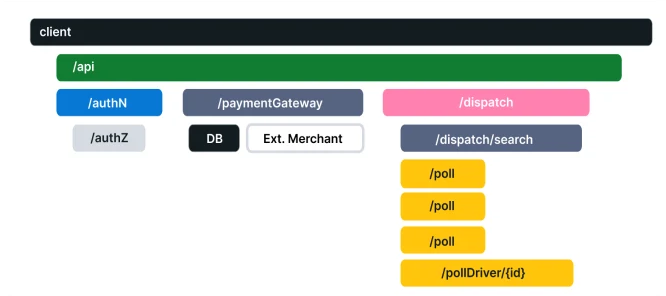

# 可观测性入门

在深入研究OpenTelemetry之前，首先了解一些核心概念是很重要的。

## 什么是可观测性

可观测性让我们从外部了解一个系统，让我们在不知道其内部运作的情况下对该系统提出问题。此外，它允许我们轻松地排除故障和处理新问题（即 "未知的未知数"），并帮助我们回答"为什么会发生这种情况"的问题。

为了能够向系统提出这些问题，应用程序必须被正确地仪表化(instrumented)。也就是说，应用程序代码必须发出[信号](https://opentelemetry.io/docs/concepts/signals/)，如[跟踪(traces)](https://opentelemetry.io/docs/concepts/observability-primer/#distributed-traces)、[度量(metrics)](https://opentelemetry.io/docs/concepts/observability-primer/#reliability--metrics)和[日志(logs)](https://opentelemetry.io/docs/concepts/observability-primer/#logs)。当开发人员不需要添加更多的仪表化工具来解决一个问题时，这个应用程序就被正确地仪表化了，因为他们有他们需要的所有信息。

[OpenTelemetry](https://opentelemetry.io/docs/concepts/what-is-opentelemetry) 是用于仪表化应用程序代码的机制，帮助使系统具备可观测性。

## 可靠性和度量

**遥测(Telemetry)**是指从一个系统发出的关于其行为的数据。这些数据可以以[跟踪](https://opentelemetry.io/docs/concepts/observability-primer/#distributed-traces)、[指标](https://opentelemetry.io/docs/concepts/observability-primer/#reliability--metrics)和[日志](https://opentelemetry.io/docs/concepts/observability-primer/#logs)的形式出现。

**可靠性(Reliability)**回答了一个问题：“服务是否在按照用户期望的方式运行？”一个系统可能一直处于运行状态，但如果当用户点击“添加到购物车”将黑色长裤添加到他们的购物车时，系统却一直在添加一条红色的长裤，则该系统就被认为是不可靠的。

**指标(Metrics)**是关于基础设施或应用程序的数字数据在一段时间内的聚合。例如：系统错误率、CPU利用率、给定服务的请求率等。

**服务水平指标(SLI)**表示对服务行为的度量。一个好的 SLI 是从用户的角度来衡量你的服务。例如，一个 SLI 可以是网页的加载速度。

**服务水平目标(SLO)**表示将可靠性传达给组织/其他团队的手段。这是通过将一个或多个 SLI 附加到业务价值上来实现的。

## 理解分布式追踪

为了理解分布式跟踪，让我们从一些基础知识开始。

### 日志

日志是由服务或其他组件发出的带有时间戳的消息。然而，与追踪不同的是，它们不一定与任何特定的用户请求或事务相关联。它们在软件中几乎随处可见，而且在过去一直被开发者和操作者严重依赖，以帮助他们理解系统行为。

日志样本：

```
I, [2021-02-23T13:26:23.505892 #22473]  INFO -- : [6459ffe1-ea53-4044-aaa3-bf902868f730] Started GET "/" for ::1 at 2021-02-23 13:26:23 -0800
```

不幸的是，日志对于跟踪代码的执行并不是非常有用，因为它们通常缺乏上下文信息，比如它们是从哪里被调用的。

当它们作为 [Span](https://opentelemetry.io/docs/concepts/observability-primer/#spans) 的一部分被包含时，它们就会变得更加有用。

### 跨度(Spans)

一个跨度(Span)代表一个工作或操作单位。它跟踪一个请求所做的具体操作，描绘出在该操作被执行期间所发生的事情。

Span 包含名称、与时间相关的数据、[结构化日志信息](https://opentelemetry.io/docs/concepts/signals/traces/#span-events)和[其他元数据](https://opentelemetry.io/docs/concepts/signals/traces/#attributes)（如[属性](https://opentelemetry.io/docs/concepts/signals/traces/#attributes)），以提供关于它所追踪的操作的信息。

下面是一些表示跨度的例子：

#### Span 属性

| Key              | Value                                    |
| ---------------- | ---------------------------------------- |
| net.transport    | IP.TCP                                   |
| net.peer.ip      | 10.244.0.1                               |
| net.peer.port    | 10243                                    |
| net.host.name    | localhost                                |
| http.method      | GET                                      |
| http.target      | /cart                                    |
| http.server_name | frontend                                 |
| http.route       | /cart                                    |
| http.scheme      | http                                     |
| http.host        | localhost                                |
| http.flavor      | 1.1                                      |
| http.status_code | 200                                      |
| http.user_agent  | Mozilla/5.0 (Macintosh; Intel Mac OS X 10_15_7) AppleWebKit/537.36 (KHTML, like Gecko) Chrome/106.0.0.0 Safari/537.36 |

> 有关 Spans 的更多信息以及它们与 OTel 的关系，请访问 [OpenTelemetry in Spans](https://opentelemetry.io/docs/concepts/signals/traces/#spans-in-opentelemetry)。

## 分布式追踪

**分布式跟踪(Distributed Trace)**，更常见的是**跟踪(Trace)**，记录请求（由应用程序或最终用户提出）在多服务架构（如微服务和无服务器应用程序）中传播的路径。

如果没有追踪，要在分布式系统中找出性能问题的原因是很困难的。

它提高了我们的应用或系统健康状况的可见性，让我们能够调试难以在本地重现的行为。跟踪对于分布式系统来说是必不可少的，因为这些系统通常有非确定性的问题，或者过于复杂而无法在本地重现。

追踪通过分解请求流经分布式系统时发生的事情，使调试和理解分布式系统变得不那么困难。

一个追踪是由一个或多个跨度(Span)组成的。第一个跨度代表根跨度。每个根跨度代表一个请求从开始到结束。父级跨度下面的跨度提供了一个更深入的上下文，即在一个请求中发生了什么（或哪些步骤构成了一个请求）。

许多可观测后端将 Trace 可视化为瀑布图(waterfall diagrams)，看起来像下面这样：



瀑布图显示了根跨度和其子跨度之间的父子关系。当一个 Span 封装了另一个 Span，这也代表了一种嵌套关系。

> 欲了解更多关于追踪以及它们如何与 OTel 相关的信息，请访问 [OpenTelemetry 追踪](https://opentelemetry.io/docs/concepts/signals/traces/)。

### 