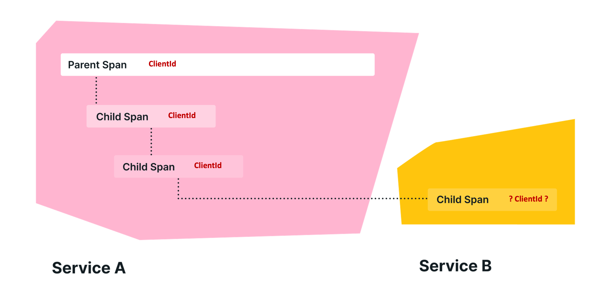

# 包裹(Baggage)

**包裹(Baggage)**是指在跨度(Span)之间传递的上下文信息。

在 OpenTelemetry 中，包裹是在跨度之间传递的上下文信息。它是一个键值存储，与追踪(trace)中的跨度上下文一起存在，使该追踪中创建的任何跨度都可以访问这些值。

例如，假设你想在你的追踪中的每个跨度上有一个 CustomerId 属性，这涉及到多个服务；然而，CustomerId 只在一个特定的服务中可用。为了实现你的目标，你可以使用OpenTelemetry 中的包裹在你的系统中传播该值。

OpenTelemetry 使用[上下文传播（Context Propagation）](https://opentelemetry.io/docs/concepts/signals/traces/#context-propagation)来传递包裹，每个不同的库实现都有传播器来解析并使包裹可用，而不需要你显式的实现它。



## 为什么会存在 OTel Baggage？

包裹(Baggage)提供了一种统一的方式来存储和传播信息，跨越追踪和其他信号。例如，你可能想把你的应用程序的信息附加到一个跨度上，并在很久以后检索该信息，然后在另一个跨度上使用它。然而，opentelemetry 中的**跨度在创建后是不可改变的**，并且可以在你以后需要它们的信息之前导出。包裹允许你通过提供一个存储和检索信息的地方来解决这个问题。

## OTel Baggage 应该用于什么？

**OTel 包裹应该用于您可以公开传递给第三方的非敏感数据**。这是因为它存储在 HTTP 头中，与当前上下文一起传递。

常见的用例包括仅在堆栈更高的位置才能访问的信息。例如，这可以包括帐户标识、用户ID、产品ID和原始IP等内容。将这些信息传递到堆栈中的下游服务中，使您可以将它们添加到跨度中，以便在搜索可观测性后端时更容易进行过滤。

这里没有内置的完整性检查来确保包裹项(Baggage item)属于您自己，因此在检索它们时要谨慎。


## Baggage 与 Span 特性不一样

关于包裹(Baggage)需要注意的一件事是，它不是跨度(Span)属性的一个子集。当你把某样东西作为包裹添加时，它不会自动出现在子系统的跨度的特性(Attributes)中。你必须明确地从包裹中取出一些东西，并将其附加到特性中。

例如，在.NET中你可以这样做：

```c#
var accountId = Baggage.GetBaggage("AccountId");
Activity.Current?.SetTag("AccountId", accountId);
```

> 更多信息，参见[包裹规范](https://opentelemetry.io/docs/reference/specification/overview/#baggage-signal)