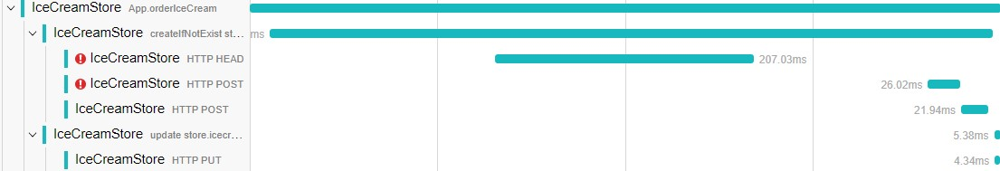

# 仪表库

学习如何为您的库添加本地仪表。

OpenTelemetry 为许多库提供仪表库，通常是通过库钩子或猴子补丁库代码完成的。

使用 OpenTelemetry 进行本地库仪表可以为用户提供更好的可观测性和开发人员体验，消除了库公开和记录钩子的需求：

- 自定义日志钩子可以被常见的、易于使用的 OpenTelemetry API 所取代，用户将只与 OpenTelemetry 进行交互。
- 来自库和应用程序代码的追踪、日志、指标是相互关联且一致。
- 共同的约定允许用户在相同的技术、不同的库和语言中获得相似和一致的遥测数据。
- 使用广泛记录的 OpenTelemetry 可扩展性点，可以为各种消费方案微调（过滤、处理、聚合）遥测信号。

## 语义约定

检查一下可用的语义约定，这些约定涵盖了网络框架、RPC 客户端、数据库、信息传递客户端、基础设施等等！

如果你的库是这些东西之一，请遵循这些规则，它们是真相的主要来源，并告诉哪些信息应该包含在跨度中。规则使仪表一致：使用遥测的用户不必学习库的细节，可观测性供应商可以为各种技术（例如数据库或消息系统）构建体验。当库遵循约定时，许多场景可以在用户的输入或配置下自动启用。

如果你有任何反馈或想添加一个新的约定--请来贡献吧 [Instrumentation Slack](https://cloud-native.slack.com/archives/C01QZFGMLQ7) 或 [Specification 仓库](https://github.com/open-telemetry/opentelemetry-specification) 是一个很好的开始。

## 何时不仪表化

有些库是仅仅封装了网络调用的薄客户端。OpenTelemetry 很可能已经为底层 RPC 客户端提供了仪表库（请查看注册表）。在这种情况下，仪表化封装库可能是不必要的。

如果符合以下条件，则不要仪表化：

- 您的库是文档化的或者是自我解释(self-explanatory)的 API 的薄代理
- OpenTelemetry 为底层网络调用提供了仪器库
- 你的库在丰富遥测内容方面没有任何约定可循

如果您有疑问，就不要仪表化 - 您可以在以后需要的时候随时这样做。

如果你选择不检测，为你的内部 RPC 客户端实例提供一种配置 OpenTelemetry 处理程序的方法可能仍然有用。这在不支持完全自动检测的语言中是必不可少的，而在其他语言中仍然有用。

如果你决定这样做，本文档的其余部分将对测量什么和如何进行测量提供指导。

## OpenTelemetry API

第一步是依赖 OpenTelemetry API 包。

OpenTelemetry 有两个主要模块——API 和 SDK。OpenTelemetry API 是一组抽象和非操作性的实现。除非应用程序导入 OpenTelemetry SDK，否则您的工具包(instrumentation packages)不会起作用，也不会影响应用程序性能。

库应该只使用 OpenTelemetry API。

您可能担心添加新的依赖关系，以下是一些考虑因素，以帮助您决定如何最小化依赖关系：

- OpenTelemetry Trace API 在2021年初达到了稳定状态，它遵循[语义化版本控制2.0](https://opentelemetry.io/docs/reference/specification/versioning-and-stability)，并且我们认真对待 API 的稳定性。
- 当使用依赖项时，请使用最早的稳定 OpenTelemetry API（1.0.*），并避免更新它，除非您必须使用新功能。
- 在您的仪表工具稳定之前，请考虑将其作为单独的软件包进行发布，这样就不会对没有使用它的用户造成问题。您可以将其保留在自己的存储库中，也可以将其[添加到OpenTelemetry](https://github.com/open-telemetry/oteps/blob/main/text/0155-external-modules.md#contrib-components) 中，以便与其他工具包一起发布。
- [语义化规范是稳定的，但可能会发生变化](https://opentelemetry.io/docs/reference/specification/versioning-and-stability/#semantic-conventions-stability)：虽然这不会导致任何功能问题，但您可能需要时不时的更新您的工具包。将其放在预览插件或 OpenTelemetry 贡献库中，可以帮助保持约定最新，而不会破坏用户的更改。

## 获取追踪器

所有应用程序配置都通过 Tracer API 隐藏在库中。默认情况下，库应该从全局的 [TracerProvider](https://opentelemetry.io/docs/reference/specification/trace/api/#get-a-tracer) 获取追踪器。

```java
private static final Tracer tracer = GlobalOpenTelemetry.getTracer("demo-db-client", "0.1.0-beta1");
```

对于库来说，有一个允许应用程序明确传递 TracerProvider 实例的 API 是很有用的，这可以实现更好的依赖注入并简化测试。

在获取追踪器时，提供你的库（或追踪插件）的名称和版本--它们显示在遥测上，帮助用户处理和过滤遥测，了解遥测数据来自何处，并调试/报告任何仪表化问题。

## 什么需要仪表化

### 公共API

公共 API 是很好的追踪候选者：为公共 API 调用创建的跨度使用户能够将遥测映射到应用程序代码，了解库调用的持续时间和结果。需要追踪哪些调用：

- 在内部进行网络调用的公共方法或需要大量时间并可能失败的本地操作（如IO）。
- 处理请求或消息的处理程序

仪表化的例子：

```java
private static final Tracer tracer = GlobalOpenTelemetry.getTracer("demo-db-client", "0.1.0-beta1");

private Response selectWithTracing(Query query) {
    // check out conventions for guidance on span names and attributes
    Span span = tracer.spanBuilder(String.format("SELECT %s.%s", dbName, collectionName))
            .setSpanKind(SpanKind.CLIENT)
            .setAttribute("db.name", dbName)
            ...
            .startSpan();

    // makes span active and allows correlating logs and nest spans
    try (Scope unused = span.makeCurrent()) {
        Response response = query.runWithRetries();
        if (response.isSuccessful()) {
            span.setStatus(StatusCode.OK);
        }

        if (span.isRecording()) {
           // populate response attributes for response codes and other information
        }
    } catch (Exception e) {
        span.recordException(e);
        span.setStatus(StatusCode.ERROR, e.getClass().getSimpleName());
        throw e;
    } finally {
        span.end();
    }
}
```

遵循约定来填充属性!如果没有适用的约定，请查看[通用约定](https://opentelemetry.io/docs/reference/specification/trace/semantic_conventions/span-general/)。

### 嵌套网络和其它跨度

网络调用通常通过 OpenTelemetry 自动检测通过相应的客户端实现进行追踪。



如果 OpenTelemetry 不支持追踪您的网络客户端，请谨慎考虑，以下是一些考虑因素：

- 追踪网络调用会提高用户的可观测性或你支持用户的能力吗？
- 你的库是在公共的、记录在案的 RPC API 之上的封装器吗？如果出现问题，用户是否需要从底层服务中获得支持？
- 仪表化库进行测试，并确保追踪单个网络尝试。
- 用跨度追踪这些调用会不会非常冗长？ 或者会不会明显影响性能？
- 使用具有冗长性的日志或跨度事件：日志可以与父级（公共 API 调用）相关联，而跨度事件应该设置在公共 API 跨度上。
- 如果它们必须是跨度（携带和传播独特的追踪上下文），把它们放在配置选项后面，并默认禁用它们。

如果 OpenTelemetry 已经支持追踪你的网络调用，你可能不想再重复它了。可能有一些例外情况。
支持没有自动仪表的用户（这在某些环境中可能不起作用，或者用户可能对猴子修补有顾虑）。

启用与底层服务的自定义（遗留）关联和上下文传播协议。

丰富 RPC 的跨度，使其具有绝对重要的库/服务特定的信息，而这些信息没有被自动仪表所覆盖。

警告：避免重复的通用解决方案正在建设中 🚧。

### 事件

追踪(traces)是你的应用程序可以发出的一种信号。事件（或日志）和追踪是相互补充的，而不是重复的。每当您有需要详细信息时，日志比跟踪更好。

很有可能您的应用程序已经使用了日志记录或类似的模块。您的模块可能已经具有 OpenTelemetry 集成 - 要找出，请查看[注册表](https://opentelemetry.io/ecosystem/registry/)。集成通常在所有日志上标记活动跟踪上下文，因此用户可以将它们相关联。

如果您的语言和生态系统没有常见的日志记录支持，请使用[跨度事件](https://opentelemetry.io/docs/reference/specification/trace/api/#add-events)共享其他应用程序详细信息。如果您想添加属性，则事件可能更方便。

作为经验法则，对于详细数据，请使用事件或日志而不是跨度。始终将事件附加到您的仪表创建的跨度实例。如果可以，请避免使用活动跨度，因为您无法控制其引用的内容。

## 上下文传播

### 提取上下文

如果您正在开发一个接收上游调用的库和服务，例如一个网络框架或一个消息消费者，你应该从传入的请求/消息中提取上下文。OpenTelemetry 提供了 Propagator API，它隐藏了特定的传播标准，并从电线上读取追踪上下文。对于单个响应，线路上只有一个上下文，它成为库创建的新跨度的父级。

创建跨度后，您应通过使跨度活动（如果可能，显式地进行）向应用程序代码（回调或处理程序）传递新的跟踪上下文。

```java
// 提取上下文
Context extractedContext = propagator.extract(Context.current(), httpExchange, getter);
Span span = tracer.spanBuilder("receive")
            .setSpanKind(SpanKind.SERVER)
            .setParent(extractedContext)
            .startSpan();

// make span active so any nested telemetry is correlated
try (Scope unused = span.makeCurrent()) {
  userCode();
} catch (Exception e) {
  span.recordException(e);
  span.setStatus(StatusCode.ERROR);
  throw e;
} finally {
  span.end();
}
```

这里是在 [Java 中提取上下文的完整例子](https://opentelemetry.io/docs/instrumentation/java/manual/#context-propagation)，请查看 OpenTelemetry 在你的语言中的文档。

在消息系统的情况下，你可能会同时收到不止一条消息。收到的消息会成为你创建的跨度上的[链接](https://opentelemetry.io/docs/instrumentation/java/manual/#create-spans-with-links)。详细情况请参考[消息传递约定](https://opentelemetry.io/docs/reference/specification/trace/semantic_conventions/messaging/)（警告：消息传递约定是在[构造下](https://github.com/open-telemetry/oteps/pull/173)）。

### 注入上下文

当你进行向外调用时，你通常希望将上下文传播给下游服务。在这种情况下，你应该创建一个新的跨度来追踪外发呼叫，并使用 Propagator API 将上下文注入消息中。在其他情况下，你可能想注入上下文，例如，在创建消息进行异步处理时。

```java
Span span = tracer.spanBuilder("send")
            .setSpanKind(SpanKind.CLIENT)
            .startSpan();

// make span active so any nested telemetry is correlated
// even network calls might have nested layers of spans, logs or events
try (Scope unused = span.makeCurrent()) {
  // inject the context
  propagator.inject(Context.current(), transportLayer, setter);
  send();
} catch (Exception e) {
  span.recordException(e);
  span.setStatus(StatusCode.ERROR);
  throw e;
} finally {
  span.end();
}
```

这里是 [Java 中上下文注入的完整例子](https://opentelemetry.io/docs/instrumentation/java/manual/#context-propagation)。

可能有一些例外情况：

- 下游服务不支持元数据或禁止未知字段
- 下游服务没有定义相关协议。是否有可能未来的某个服务版本会支持兼容的上下文传播？注入它!
- 下游服务支持自定义相关协议。
  - 使用尽力而为的自定义传播器：如果兼容的话，使用 OpenTelemetry 跟踪上下文。
  - 或者在跨度上生成和盖上自定义相关ID。

### 进程内

- 确保你的跨度处于活动状态（又称当前状态）：它使跨度与日志和任何嵌套的自动仪表(auto-instrumentations)相关联。
- 如果库具有上下文的概念，请除了活动跨度之外，支持可选的显式跟踪上下文传播

  - 将库创建的跨度（跟踪上下文）明确地放入上下文中，并记录如何访问它。
  - 允许用户在你的上下文中传递追踪上下文
- 在库中，明确地传播追踪上下文--活动跨度在回调过程中可能会发生变化!
  - 尽快从公共 API 表面的用户那里捕获活动上下文，将其作为你的跨度的父级上下文。
  - 传递上下文，在明确传播的实例上标记属性、异常和事件
  - 如果你明确地启动线程，做后台处理或进行其他由于语言中的异步上下文流限制而可能中断的操作，这是很有必要的。

## 度量

目前[度量 API](https://opentelemetry.io/docs/reference/specification/metrics/api/) 还不稳定，我们还没有定义度量规约。

## 杂项

### 仪表注册表

请将您的仪表库添加到 [OpenTelemetry 注册表](https://opentelemetry.io/ecosystem/registry/)中，以便用户可以找到它。

### 性能

当应用程序中没有 SDK 时，OpenTelemetry API 是无操作的，性能非常好。配置 OpenTelemetry SDK 时，会消耗[绑定资源](https://opentelemetry.io/docs/reference/specification/performance/)。

现实中的应用，特别是高规模的应用程序，会经常配置基于头部(head-based)的采样(sampling)。采样的跨度很便宜，你可以检查跨度是否在记录，以避免额外的分配和潜在的昂贵计算，同时填充属性。

```java
// some attributes are important for sampling, they should be provided at creation time
Span span = tracer.spanBuilder(String.format("SELECT %s.%s", dbName, collectionName))
        .setSpanKind(SpanKind.CLIENT)
        .setAttribute("db.name", dbName)
        ...
        .startSpan();

// other attributes, especially those that are expensive to calculate
// should be added if span is recording
if (span.isRecording()) {
    span.setAttribute("db.statement", sanitize(query.statement()))
}
```

### 错误处理

OpenTelemetry API [在运行时是宽松的](https://opentelemetry.io/docs/reference/specification/error-handling/#basic-error-handling-principles)——不会在无效参数上失败，从不抛出异常，并吞咽异常。这样，仪表问题就不会影响应用程序逻辑。测试仪表以注意 OpenTelemetry 在运行时隐藏的问题。

### 测试

由于 OpenTelemetry 具有多种自动仪表化功能，因此尝试了解您的仪器化如何与其他遥测交互是很有用的：包括入站请求、出站请求、日志等。在尝试您的仪器化时，请使用典型的应用程序，使用流行的框架和库以及启用所有追踪。检查类似于您的库的表现如何。

对于单元测试，您通常可以模拟或伪造 `SpanProcessor` 和 `SpanExporter`。

```java
@Test
public void checkInstrumentation() {
  SpanExporter exporter = new TestExporter();

  Tracer tracer = OpenTelemetrySdk.builder()
           .setTracerProvider(SdkTracerProvider.builder()
              .addSpanProcessor(SimpleSpanProcessor.create(exporter)).build()).build()
           .getTracer("test");
  // run test ...

  validateSpans(exporter.exportedSpans);
}

class TestExporter implements SpanExporter {
  public final List<SpanData> exportedSpans = Collections.synchronizedList(new ArrayList<>());

  @Override
  public CompletableResultCode export(Collection<SpanData> spans) {
    exportedSpans.addAll(spans);
    return CompletableResultCode.ofSuccess();
  }
  ...
}
```

